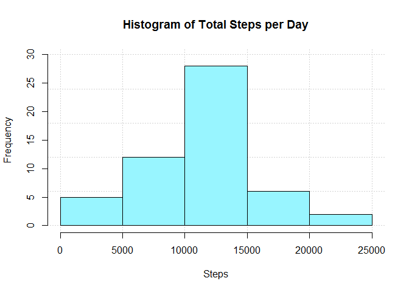
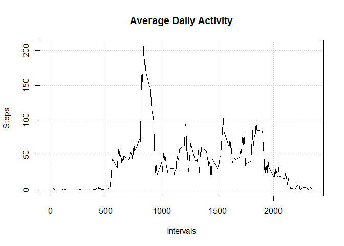
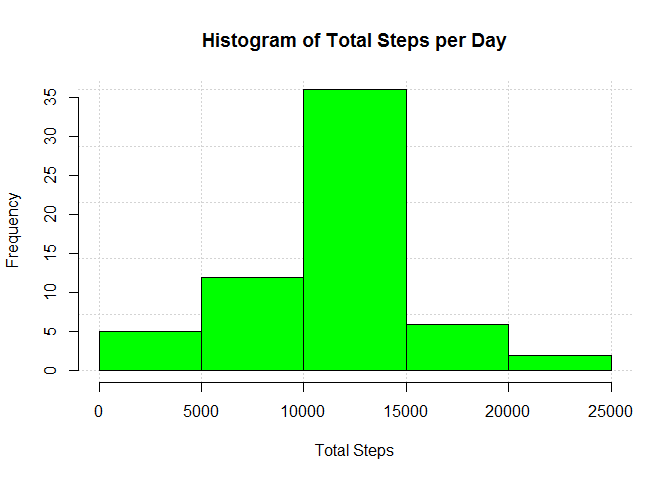
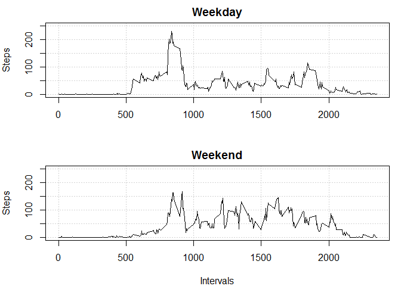

This assignment makes use of data from a personal activity monitoring device. 
This device collects data at 5 minute intervals through out the day. 
The data consists of two months of data from an anonymous individual collected 
during the months of October and November, 2012 and include the number of steps 
taken in 5 minute intervals each day.

## Loading and preprocessing the data
1. Load the data

```r
unzip("activity.zip")
activity <- read.csv("activity.csv", stringsAsFactors = F)
```

2. Process/transform the data (if necessary) into a format suitable for your   analysis

```r
library(dplyr)
```

```
## 
## Attaching package: 'dplyr'
```

```
## The following objects are masked from 'package:stats':
## 
##     filter, lag
```

```
## The following objects are masked from 'package:base':
## 
##     intersect, setdiff, setequal, union
```

```r
library(lubridate)
```

```
## 
## Attaching package: 'lubridate'
```

```
## The following object is masked from 'package:base':
## 
##     date
```

```r
h_activity <- as_tibble(activity)
```

## What is mean total number of steps taken per day?
For this part of the assignment, you can ignore the missing values in the dataset.

1. Calculate the total number of steps taken per day

```r
data1 <- filter(h_activity, !is.na(h_activity$steps))
total_steps <- tapply(data1$steps, data1$date, sum)
```

2. Make a histogram

```r
hist(total_steps, col = "cadetblue1", main = "Histogram of Total Steps per Day", xlab = "Steps", panel.first = grid(), ylim = c(0, 30))
```

<!-- -->

3. Calculate and report the mean and median of the total number of steps taken    per day

```r
mean(total_steps)
```

```
## [1] 10766.19
```

```r
median(total_steps)
```

```
## [1] 10765
```

## What is the average daily activity pattern?
1. Make a time series plot of the 5-minute interval (x-axis) and the average number of steps taken, averaged across all days (y-axis)

```r
average_steps <- tapply(data1$steps, data1$interval, mean)
plot(unique(data1$interval), average_steps, type = "l", xlab = "Intervals", ylab = "Steps", main = "Average Daily Activity", panel.first = grid())
```

<!-- -->

2. Which 5-minute interval, on average across all the days in the dataset, contains the maximum number of steps?

```r
dimnames(average_steps)[[1]][match(max(average_steps), average_steps)]
```

```
## [1] "835"
```

## Imputing missing values
Note that there are a number of days/intervals where there are missing values (coded as NA). 
The presence of missing days may introduce bias into some calculations or summaries of the data.

1. Calculate and report the total number of missing values in the dataset

```r
nas <- is.na(h_activity$steps)
data2 <- h_activity[nas,]
nrow(data2)
```

```
## [1] 2304
```

2. Devise a strategy for filling in all of the missing values in the dataset. 

   In this case, the strategy consider the mean per 5-minute interval

3. Create a new dataset that is equal to the original dataset but with the missing data filled in.

```r
h_activity2 <- h_activity
na_dates <- table(data2$date)
df_range <- data.frame()
for (i in 1:dim(na_dates)) {
df_range[i, 1:2] <- range(which(h_activity2$date == dimnames(na_dates)[[1]][i]))
}

for (i in 1:dim(na_dates)) {
h_activity2[df_range[i,1]:df_range[i,2], 1] <- average_steps
}
```

4. Make a histogram of the total number of steps taken each day and Calculate and report the mean and median total number of steps taken per day. Do these values differ from the estimates from the first part of the assignment? What is the impact of imputing missing data on the estimates of the total daily number of steps?

```r
total_steps2 <- tapply(h_activity2$steps, h_activity2$date, sum)
hist(total_steps2, col = "green", main = "Histogram of Total Steps per Day", xlab = "Total Steps", panel.first = grid())
```

<!-- -->

```r
mean(total_steps2)
```

```
## [1] 10766.19
```

```r
median(total_steps2)
```

```
## [1] 10766.19
```
Note: Due to the strategy to fill missing values (NA), which in this case is to consider the mean per interval, the diference between the two datasets (without NA and with NA) is relatively low if we check the mean and median per each set, but if we compare the two histograms, there is an increment in the bar size

## Are there differences in activity patterns between weekdays and weekends?
1. Create a new factor variable in the dataset with two levels – “weekday” and “weekend” indicating whether a given date is a weekday or weekend day.

```r
Sys.setlocale("LC_TIME", "English")
```

```
## [1] "English_United States.1252"
```

```r
my_date <- ymd(h_activity2$date)
date1 <- weekdays(my_date)
new_var <- factor(date1, levels = c("Monday", "Tuesday", "Wednesday", "Thursday", "Friday", "Saturday", "Sunday") ,labels = c("weekday", "weekday", "weekday", "weekday", "weekday", "weekend", "weekend"))
h_activity3 <- mutate(h_activity2 ,day = new_var)
```

2. Make a panel plot containing a time series plot of the 5-minute interval (x-axis) and the average number of steps taken, averaged across all weekday days or weekend days (y-axis). 

```r
s1 <- filter(h_activity3, h_activity3$day == "weekday")
s2 <- filter(h_activity3, h_activity3$day == "weekend")
average_steps3 <- tapply(s2$steps, s2$interval, mean)
average_steps4 <- tapply(s1$steps, s1$interval, mean)
par(mfrow = c(2,1), mar = c(4,4,2,1))
plot(unique(s1$interval), average_steps4, type = "l", ylim = c(0, 250), xlab = "", ylab = "Steps", main = "Weekday", panel.first = grid())
plot(unique(s2$interval), average_steps3, type = "l", ylim = c(0, 250), xlab = "Intervals", ylab = "Steps", main = "Weekend", panel.first = grid())
```

<!-- -->


